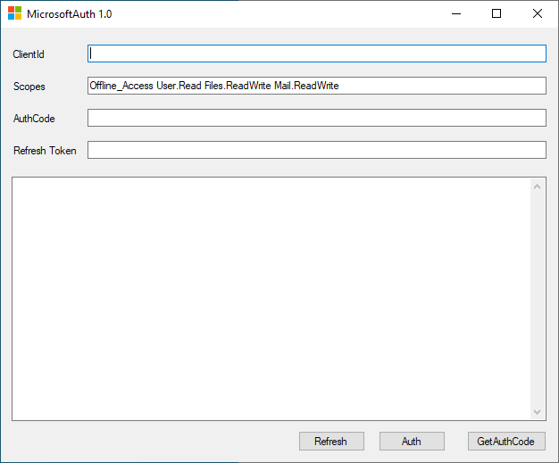

# MicrosoftAuth
The application requests an access token from the Microsoft Authorization Server, extracts a token from the response.  

# basic
vs2019 + net4.0 + c#

# usage
<pre>
    First: GetAuthCode
    Second: Auth
</pre>
